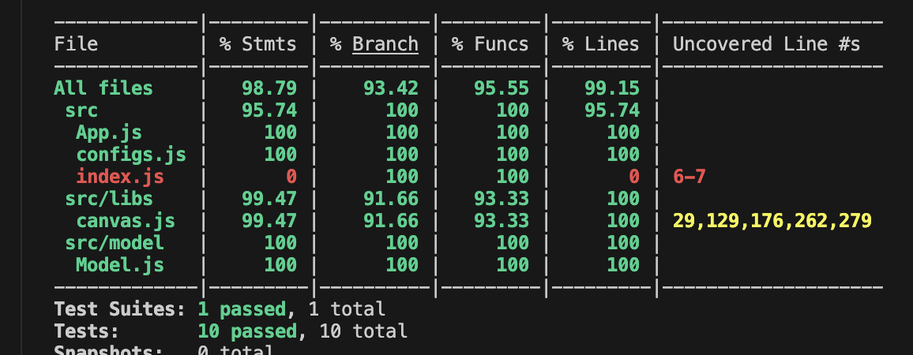

# madness starter app

To utilize these files：
first use command: npm install (to get the node_modules)
second use command: npm start (to open the browser and test the game )
third use command: npm test -- --coverage (to get the test results)

